# EduCollab: A MERN Stack Project

## Description
EduCollab is a web application aimed at enhancing the educational experience by providing a platform for students to collaborate, showcase their projects, and connect with peers. It facilitates sharing knowledge, receiving feedback, and exploring new opportunities in academia.

## Tech Stack Used
- **MongoDB:** NoSQL database for storing user data and project information.
- **Express.js:** Backend web application framework running on Node.js.
- **React:** Frontend library for building the user interface.
- **Node.js:** JavaScript runtime environment for executing server-side JavaScript code.

## User Research
User research was conducted to understand the needs and challenges faced by students in collaborating and sharing their academic projects. Insights gathered from surveys and interviews helped in shaping the features and functionalities of EduCollab.

## Future Updates
Planned updates include:
- Implementation of wish-list including liked projects, courses, and profiles.
- Implementation of dynamic search feature for projects, courses, and profiles.
- AI based doubt solving.
- Enable project owner to approve or reject requests for collaborator access to the project.
- Integration with educational resources and APIs.
- Mobile app enhancements for better user engagement.

## Different Pages
- **Project Showcase:** Detailed view of projects with comments and rating support.
- **Profile Page:** Where students can showcase their skills and projects.
- **Chatroom:** Chat with other students on collaborated projects.
- **Course Review Page:** For sharing and reading course reviews.
- **Doubts Page:** A platform for asking for help and sharing knowledge.

## Features
- Average rating and feedback system for projects and courses.
- Implement a 'request for assistance' feature that displays diverse responses, empowering users to  upvote or downvote each answer.
- Launch a decentralized credit system assigning initial credits to new users, enabling credit growth through net positive upvotes on answers or successful collaborative project completion, with individual project credits capped at 10% of the project owner's total credits.
- Anti-spam engine to maintain a clean environment by implementing OAuth2.0 and restricting number of comments or answers on projects or doubts respectively.
- Introduce a project-specific chat room enabling real-time communication among all collaborating users of a particular project.

## User Interface
The user interface is designed to be intuitive and user-friendly, emphasizing ease of navigation and accessibility. It includes responsive design for compatibility with various devices and screen sizes.

## Installation and Setup

1. **Prerequisites:**
   - Node.js and npm installed.
   - MongoDB set up either locally or in the cloud.

2. **Clone the Repository:**
   ```sh
   git clone https://github.com/t-kadre/EduCollab.git
   cd EduCollab
   ```

3. **Backend Setup:**
   - Navigate to the backend directory.
   - Install dependencies:
     ```sh
     cd backend
     npm install
     ```
   - Start the server:
     ```sh
     npm start
     ```

4. **Frontend Setup:**
   - Navigate to the frontend directory.
   - Install dependencies:
     ```sh
     cd frontend
     npm install
     ```
   - Start the React app:
     ```sh
     npm start
     ```
   - The application should now be running on `http://localhost:3000`.

5. **Environment Variables:**
   Make a file named .env in the backend folder, it's content should be:
   ```sh
    MONGO_URI = "MongoDB URI to connect"
    CALLBACK_URL = "http://localhost:5500/auth/microsoft/redirect"
    CLIENT_ID = "Your Microsoft Client ID"
    CLIENT_SECRET = "Your Microsoft Client Secret"
    GOOGLE_APPLICATIONS_CREDENTIALS='Google Firebase Application Account Credentials'
    CLOUD_NAME='Cloudinary Name'
    CLOUD_API_KEY='Cloudinary API Key'
    CLOUD_API_SECRET='Cloudinary API Secret'
    ```

## Web Application Snippets


1. Microsoft Authentication<br>

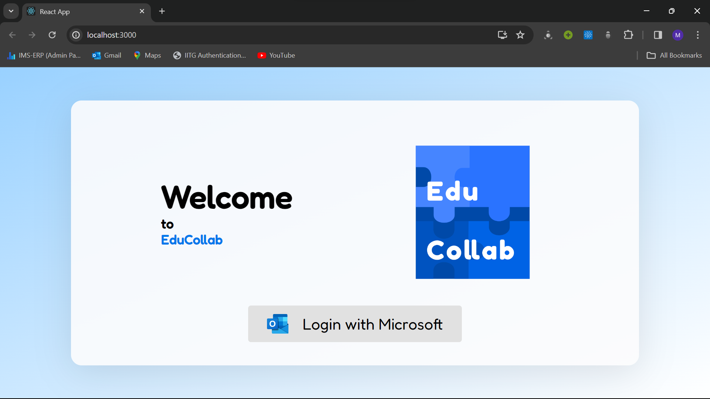<br>

2. Dashboard displaying all projects as well as your own projects<br>

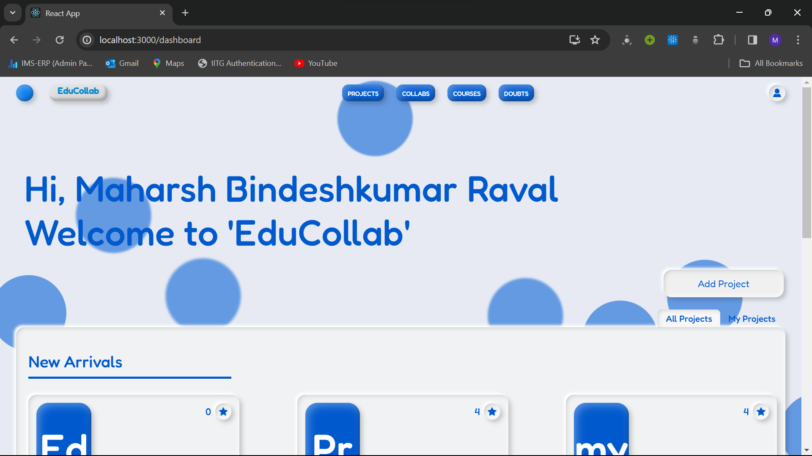<br>

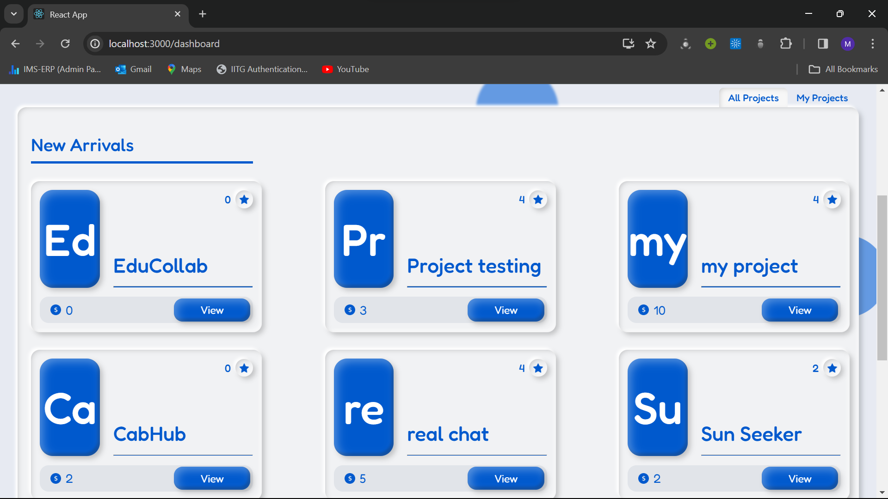<br>

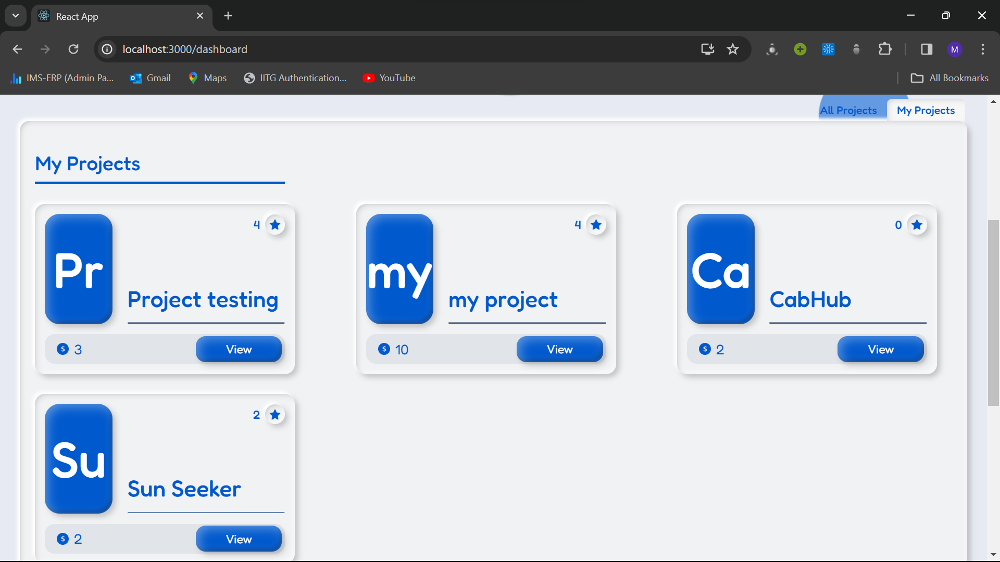<br>

3. Detailed Project pop-out displaying the project owner, project description, Project Reviews, Techstacks used, Link to join project community and the amount of per head credits to be rewarded<br>

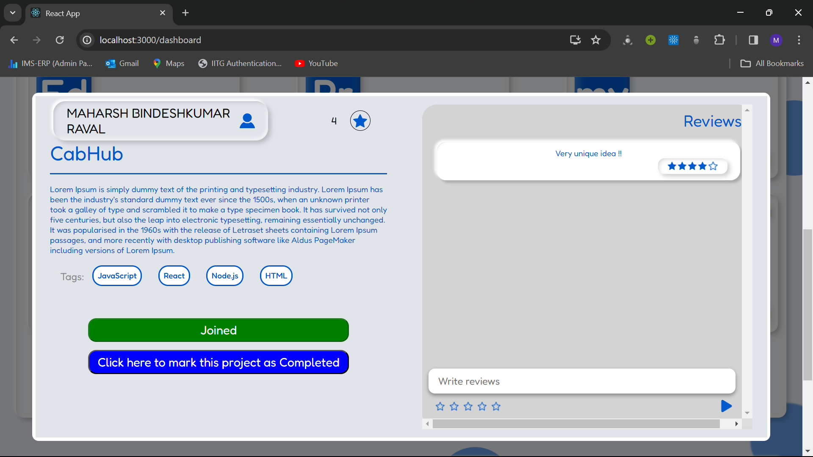<br>

4. Collaborated projects community with real-time chatting feature providing a smooth and healthy discussion about the project<br>

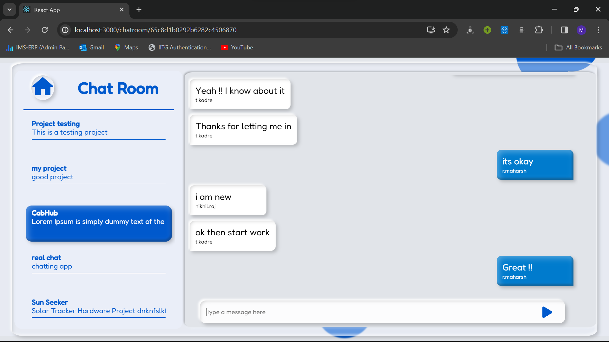<br>

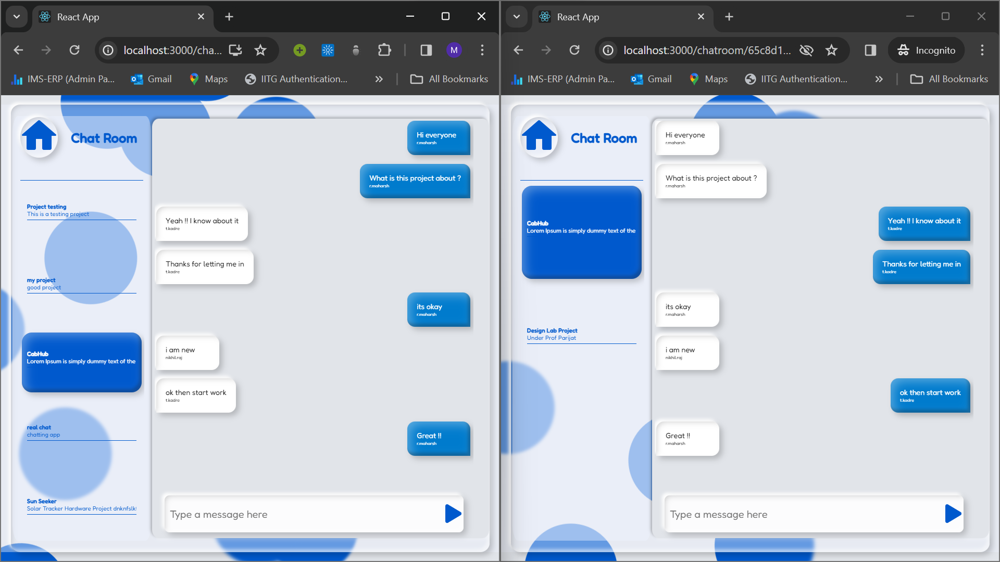<br>

5. Course Display Page<br>

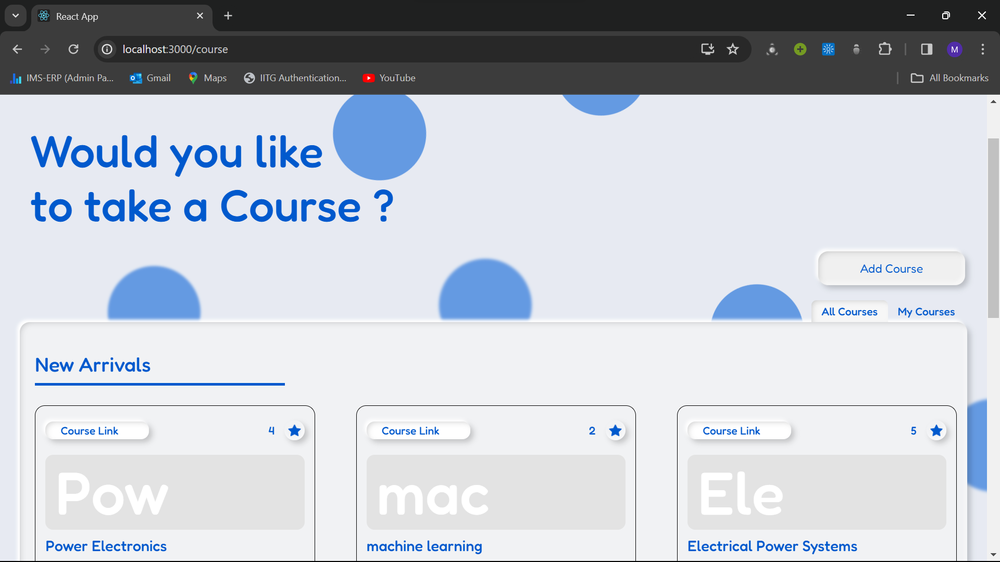<br>

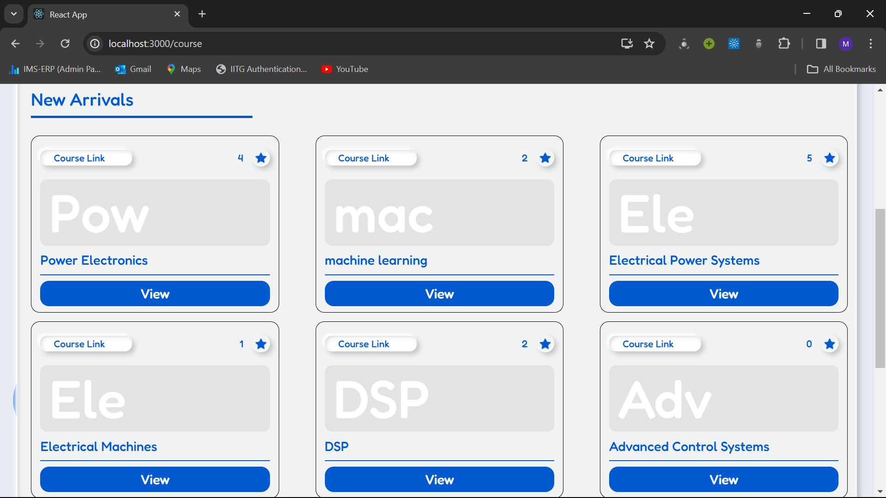<br>

6. Detailed Course pop-out displaying the course name, course details, review and feedbacks of the course from your very own campus-mates and the link to buy or get the course<br>

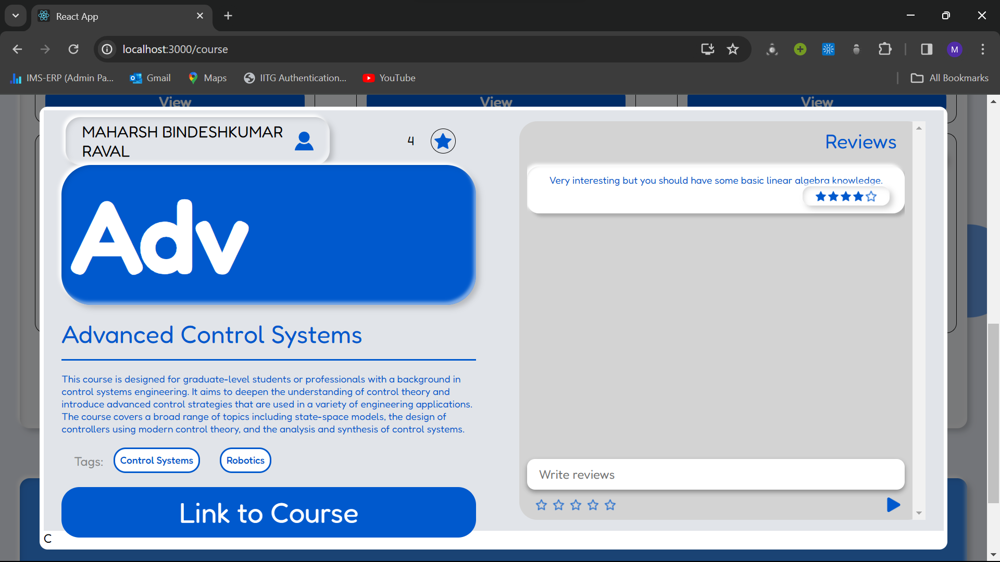<br>

7. An Ask-for-help page which enables you to post your doubt or answer other users doubts regarding your project, your college course, or any general doubt. It also allows you to upvote or downvote an answer so that you can get the best answer for your query<br>

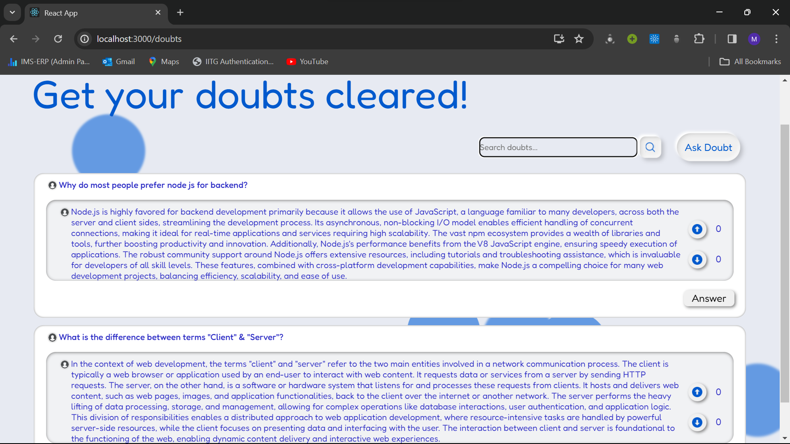<br>

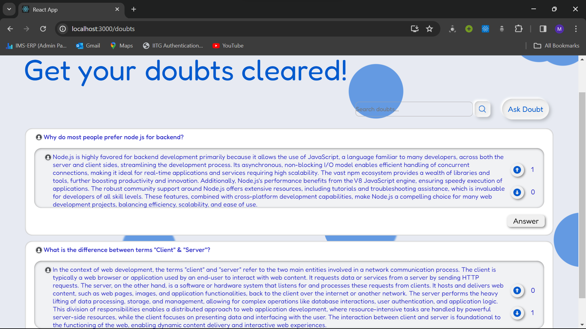<br>
